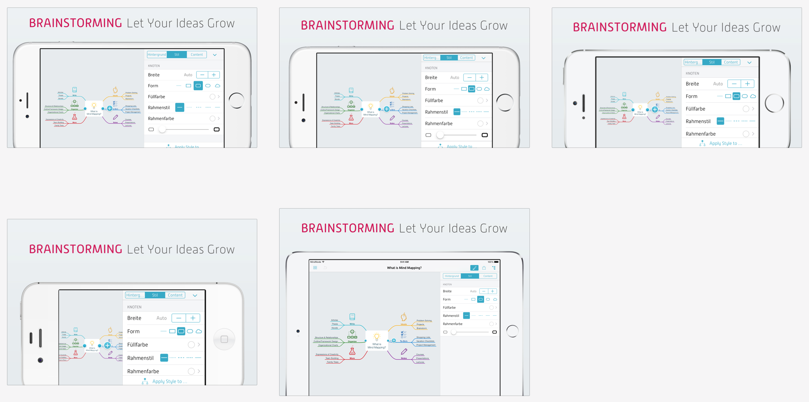
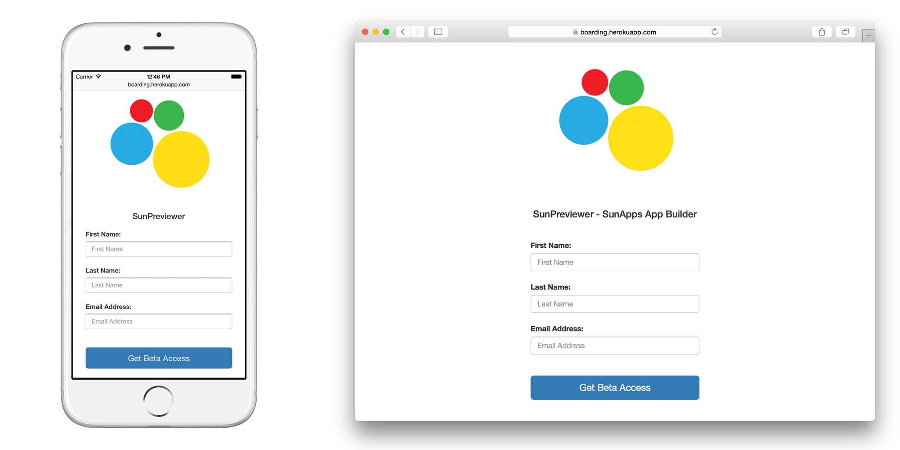

# Fastlane
Automated beta deployments and releases for iOS and Android apps

---

## Setup

* Run `brew cask install fastlane`
* Follow prompts

Creates file structure:
* fastlane (directory)
  * Appfile
  * Fastfile
  * Matchfile
  * README.md

---

## Code Signing
### Match
Creates all required certificates and provisioning profiles and stores them in a separate git repository

---

## Match Setup
* Create git repo named "certificates" or something
* Run `fastlane match init`
* Follow the prompts and enter in the git repo url (or edit Matchfile), and enter a passphrase for the repo
* Run `fastlane match development` (or `appstore`)

[https://github.com/smartlogic/xcode-certificates](https://github.com/smartlogic/xcode-certificates)

---

## Lanes
```ruby
platform :ios do
  desc "Update app icons"
  lane :create_app_icons do
    # Update app icons
    appicon(
      appicon_image_file: 'fastlane/metadata/app_icon.png',
      appicon_devices: [:ipad, :iphone, :ios_marketing],
      appicon_path: 'ARSample/Images.xcassets' # output path
    )
  end
end
```

---

## Appfile
```ruby
app_identifier "com.domain.appname" # The bundle identifier of your app

itc_team_id "12345" # iTunes Connect Team ID
team_id "AABBCCDDEE" # Developer Portal Team ID
```

---

#### Build App
```ruby
lane :beta do
  build_app(scheme: "MyApp")
end
```

#### Upload App to TestFlight
```ruby
lane :beta do
  sync_code_signing(type: "appstore")
  build_app(scheme: "MyApp")
  upload_to_testflight
end
```

#### Submit Your App
```ruby
lane :release do
  capture_screenshots
  sync_code_signing(type: "appstore")
  build_app(scheme: "MyApp")
  upload_to_app_store
end
```

---

### Frameit


---

### Boarding


---

### Fastfile
```ruby
default_platform(:ios)

before_all do
  ENV["SLACK_URL"] = "https://hooks.slack.com/services/AAA/BBB/CCC"
end

platform :ios do
  desc "Upload to app store"
  lane :beta do
    # Ensure that our git status is not dirty
    ensure_git_status_clean

    sync_code_signing(type: "appstore") # see code signing guide for more information

    increment_build_number(
      build_number: latest_testflight_build_number + 1,
      xcodeproj: "ARSample.xcodeproj"
    )

    build_app(scheme: "ARSample")

    changelog_from_git_commits

    upload_to_testflight

    slack(message: "Successfully distributed a new beta build")

    # Commit the version bump
    commit_version_bump(xcodeproj: "ARSample.xcodeproj")

    # Add a git tag for this build. This will automatically
    # use an appropriate git tag name
    add_git_tag

    # Push the new commit and tag back to your git remote
    push_to_git_remote
  end

  desc "Update app icons"
  lane :app_icon do
    # Update app icons
    appicon(
      appicon_image_file: 'fastlane/metadata/app_icon.png',
      appicon_devices: [:ipad, :iphone, :ios_marketing],
      appicon_path: 'ARSample/Images.xcassets' # output path
    )
  end
end
```

---

# Questions?
